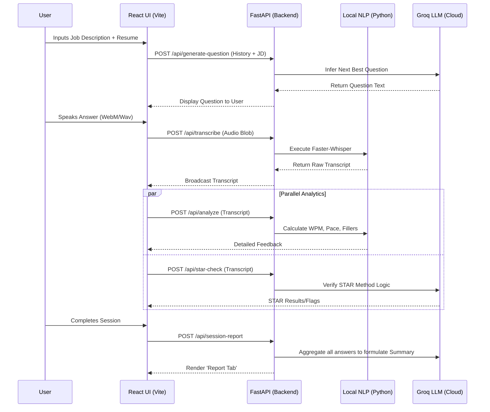

<div align="center">

# 🎯 CareerPilot - AI Interview Coach

[](https://reactjs.org/)
[](https://vitejs.dev/)
[](https://fastapi.tiangolo.com)
[](https://www.python.org/)
[](https://github.com/SYSTRAN/faster-whisper)
[](https://groq.com)

**An intelligent, fully automated interview preparation platform designed to dynamically evaluate and improve your behavioral and technical interview skills.**

</div>

---

## 📖 Overview

The **AI Interview Coach** is a modern, high-performance web application designed to simulate real-life interview experiences. By analyzing both your resume and the target job description, it generates highly targeted, dynamic questions. As you answer out loud, the platform records your voice, transcribes it instantly, and performs deep text-based Natural Language Processing (NLP) alongside Large Language Model (LLM) evaluations. 

The application doesn't just tell you *what* you said wrong—it analyzes *how* you said it. From speech pacing and filler-word tracking to evaluating whether your response aligns with the gold-standard **STAR Method** (Situation, Task, Action, Result), this platform provides unparalleled multi-dimensional feedback.

---

## ✨ Comprehensive Features List

### 🎙️ Advanced Speech Processing
- **Real-time Audio Capture:** Direct browser-based audio streaming capabilities capable of robustly saving user audio.
- **Lightning-fast Transcription:** Uses `faster-whisper` on the backend to achieve incredibly low-latency and highly accurate audio-to-text transcriptions natively.

### 🧠 Intelligent Generation & Evaluation
- **Context-Aware Interviewing:** Provide a Job Description and a Resume (parsed locally via PDF.js). The LLM uses this context combined with your session conversation history to ensure every subsequent question logically follows your last answer.
- **STAR Method Validation:** Behavioral questions are automatically cross-checked against the STAR framework. The AI maps out the situation, task, action, and result from your response, highlighting missing components to help you structure better answers.

### 📊 Metric-Driven Insights (NLP)
- **Speaking Pace:** Calculates your Words-Per-Minute (WPM) to evaluate if you are speaking too quickly (nervousness) or too slowly.
- **Filler Word Detection:** Tracks the usage of common filler words like *umm*, *uh*, *like*, and *you know*, providing actionable metrics to clean up your speech track.
- **Sentiment & Vocabulary Analysis:** Benchmarks your response using `nltk` and `TextBlob` to give real-time scoring on confidence and complexity.

### 🖥️ User Experience
- **Sleek React Interface:** Built with Vite and React 18, featuring dynamic tabs for separating the active interview flow from session reports.
- **Session Reports:** Aggregated dashboard at the end of the session summarizing all NLP metrics and global LLM feedback across all answered questions.
- **Interactive Feedback Panels:** View localized feedback directly attached to the specific question card as soon as your audio is done processing.

---

## 🛠️ Technology Stack

### Frontend Architecture
- **Framework:** React 18
- **Build & Serve:** Vite
- **HTTP Client:** Axios for interacting with the FastAPI backend
- **PDF Processing:** `pdfjs-dist` to parse Resumes and CVs entirely on the client side for privacy
- **CSS Management:** Modular Vanilla CSS tailored for an intuitive, responsive dashboard.

### Backend Architecture
- **API Framework:** FastAPI (Python) for asynchronous, high-throughput endpoints.
- **LLM Engine:** Groq API (integrated via Groq Python SDK) to handle minimal latency generative AI responses.
- **Transcription Engine:** `faster-whisper` processing local binary audio files.
- **Data Engineering:** `numpy`, `scipy` for audio chunking and metric extraction.
- **Text Processing:** `textblob` and `nltk` combined with standard text processing to compute actionable interview metrics.

---

## ⚙️ Setup & Installation

### Prerequisites
- NodeJS (v16+)
- Python (v3.9+)

### 1. Repository Setup
```bash
git clone https://github.com/yourusername/AI_Coach.git
cd AI_Coach
```

### 2. Backend Environment Verification
Create a secure Python environment and download the necessary dependencies. You may be required to install system-level audio dependencies depending on your OS.
```bash
python -m venv venv

# Activate Virtual Environment (Windows)
.\venv\Scripts\activate
# Activate Virtual Environment (Mac/Linux)
source venv/bin/activate

pip install -r requirements.txt
```

### 3. Environment Variables
You will need a Groq API Key to power the LLM functionalities. Create a `.env` file at the root of the backend configuration.
```bash
cp .env.example .env
```
Inside `.env`, define your secret keys:
```env
GROQ_API_KEY=your_secured_api_key
```

### 4. Frontend Bootstrap
Install the Node modules specifically within the frontend directory.
```bash
cd frontend
npm install
```

### 5. Running the Complete Stack
The system is bound together using `concurrently`. From the `frontend` directory, run the development script to execute both the Vite server and the Uvicorn/FastAPI server sequentially.
```bash
npm run dev
```

- **Frontend:** http://localhost:5173
- **Backend Swagger UI:** http://localhost:8000/docs

---

## 🏗️ System Architecture

The AI Interview Coach features a decoupled client-server architecture. The frontend handles state orchestration and recording logic entirely locally, securely passing chunks of data down to a stateless HTTP backend pipeline.

### High-Level Workflow Diagram



### Component Breakdown

#### FastAPI Endpoints
- **`POST /api/generate-question`**: Proxies the user's current track record and contextual job description to the Groq LLM, bypassing prompt boundaries to output a fresh, customized question.
- **`POST /api/transcribe`**: Safely receives a multipart-form audio file buffer, stores it transiently, runs `faster-whisper.transcribe_audio_file`, and wipes the disk trace immediately afterward.
- **`POST /api/analyze`**: Responsible for the mathematical extraction of NLP variables. Feeds plain text securely into the `src.analysis.full_analysis` function. Calculates speaking duration offsets.
- **`POST /api/star-check`**: Validates the cognitive quality of a behavioral answer. Checks if the Situation, Task, Action, and Result are explicitly identifiable.
- **`POST /api/session-report`**: A final rollup endpoint that runs dual executions: standardizing statistical NLP values while also fetching qualitative overarching feedback from the LLM.

#### Interface Modules
- **`Sidebar.jsx`**: Central command for user configuration. Ingests Job Descriptions and manages global reset states.
- **`InterviewTab.jsx`**: The core interactive zone. Cycles between presenting questions via `QuestionCard`, capturing input via `RecordingControls`, and previewing live context via `FeedbackPanel`.
- **`ReportTab.jsx`**: The final view rendering aggregate data points passed from the backend's `/api/session-report`.

---

## 🤝 Contributing & Extension

The modular layout makes adding new analytics trivial. If you wish to implement new features like *Video Analysis* (Gaze tracking) or *Tone mapping*:
1. Construct the calculation model in `src/`.
2. Expose the execution layer within `api.py`.
3. Integrate the layout consumption in `FeedbackPanel.jsx`

Pull requests and issue reports are highly appreciated. 

1. Fork the repo.
2. Branch out: `git checkout -b feature/NewMetric`
3. Commit styling: `git commit -m 'Added Gaze Tracking feature'`
4. Push and submit a PR!

---

## 📜 License

Distributed under the MIT License. Use it to ace your next job interview!
